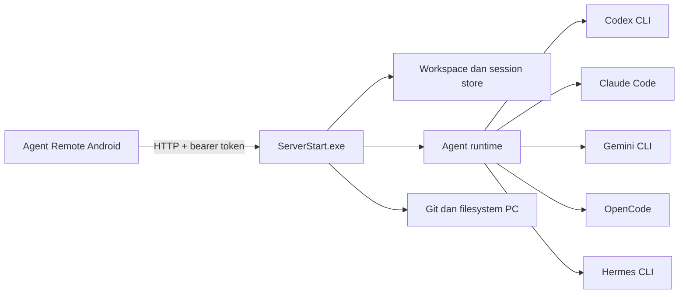

# Agent Remote

Agent Remote adalah aplikasi Android untuk mengontrol agent CLI yang berjalan di PC Windows. HP menjadi remote controller; agent, command, akses folder, Git, dan perubahan file tetap berjalan di PC.

Status dokumentasi: **22 Juli 2026**. Versi aplikasi: **0.4.1+4**.

**Pengguna baru:** mulai dari [First Setup untuk Pengguna Public](docs/PUBLIC_USER_FIRST_SETUP.md).

## Fitur utama

- Deteksi otomatis Codex, Claude Code, Gemini CLI, OpenCode, dan Hermes.
- Mode **Single**, **Parallel**, dan **Koordinator**.
- Pemilihan drive atau folder kerja tanpa hardcode.
- Session tersimpan per folder.
- Persistent timeline untuk antrean, analisis, command, editing, testing, selesai, gagal, dan dihentikan.
- Foreground notification Android dengan action **Buka** dan **Stop**.
- Notifikasi task selesai dari Codex Desktop atau Codex CLI di PC.
- Restore folder, tab, dan session terakhir.
- Upload file, galeri, kamera, dan gambar clipboard Android.
- Panel task aktif, file workspace, Git status, commit, ahead/behind, dan fetch remote.
- `AgentRemoteSetup.exe` untuk setup, QR pairing, kontrol server, dan ganti password.
- Server Windows berupa `ServerStart.exe` dan launcher aman `ServerStop.exe` tanpa jendela console.
- Tailscale akun terdaftar otomatis aktif saat server dinyalakan dan nonaktif saat server dihentikan.

## Arsitektur



Task tidak dijalankan di HP. HP hanya mengirim perintah, menerima stream, memantau proses, dan menampilkan notifikasi.

## Daftar isi

1. [Persyaratan](#persyaratan)
2. [Quick start pengguna baru](#quick-start-pengguna-baru)
3. [Menjalankan server PC](#menjalankan-server-pc)
4. [Menghubungkan HP ke PC](#menghubungkan-hp-ke-pc)
5. [Setup pertama di aplikasi](#setup-pertama-di-aplikasi)
6. [Memilih agent dan mode kerja](#memilih-agent-dan-mode-kerja)
7. [Folder, project, dan session](#folder-project-dan-session)
8. [Chat dan attachment](#chat-dan-attachment)
9. [Timeline dan background task](#timeline-dan-background-task)
10. [Git dan panel proses](#git-dan-panel-proses)
11. [Build dari source](#build-dari-source)
12. [Troubleshooting](#troubleshooting)
13. [Keamanan dan batasan](#keamanan-dan-batasan)

## Persyaratan

### Pengguna biasa

- PC Windows 10 atau Windows 11.
- Android 7.0 atau lebih baru.
- Minimal satu agent CLI terpasang dan dapat dipanggil dari `PATH` Windows.
- Port TCP `9120` dapat diakses dari HP.
- Tailscale pada PC dan HP untuk akses aman dari jaringan berbeda. LAN langsung juga didukung.
- Izin notifikasi Android agar progress task tetap terlihat saat aplikasi berada di background.

USB hanya diperlukan untuk instalasi APK melalui ADB. Setelah terpasang, Agent Remote memakai jaringan dan tidak memerlukan kabel USB.

### Developer

- Flutter SDK dan Android SDK.
- Python untuk server dan test backend.
- PyInstaller untuk membangun `ServerStart.exe` dan `ServerStop.exe`.
- Git dan CLI agent yang ingin diuji.

Pastikan agent dapat dijalankan langsung dari PowerShell sebelum membuka Agent Remote, misalnya `codex --version` atau `claude --version`.

## Quick start pengguna baru

Alur aktivasi: **siapkan CLI agent di PC -> nyalakan server -> hubungkan PC dan HP lewat Tailscale -> masukkan alamat PC di aplikasi Android**.

### 1. Siapkan file aplikasi

Pada PC, siapkan dalam satu folder:

- `AgentRemoteSetup.exe` untuk setup pertama dan QR pairing.
- `ServerStart.exe` untuk menyalakan server Windows.
- `ServerStop.exe` untuk menghentikan server dan process anaknya.
- APK Agent Remote untuk Android.

Jika repository ini dibangun sendiri, APK debug berada di `build\app\outputs\flutter-apk\app-debug.apk`. Pengguna file rilis dapat langsung memasang APK yang dibagikan tanpa ADB.

Pastikan minimal satu CLI agent sudah bekerja dari PowerShell:

```powershell
codex --version
```

Ganti `codex` dengan `claude`, `gemini`, `opencode`, atau `hermes` sesuai agent yang dipakai.

### 2. Install dan aktifkan Tailscale

Tailscale membuat jaringan privat antara PC dan HP. Port Agent Remote tidak perlu dibuka ke internet atau diteruskan melalui router.

1. Install Tailscale pada Windows dari situs resmi Tailscale.
2. Buka Tailscale di Windows, tekan **Log in**, lalu selesaikan login di browser.
3. Install aplikasi Tailscale dari Play Store pada HP.
4. Login memakai akun/tailnet yang sama dengan PC.
5. Aktifkan koneksi Tailscale di HP. Terima permintaan izin VPN Android.
6. Pastikan PC dan HP muncul sebagai dua perangkat aktif pada aplikasi atau halaman admin Tailscale.

Ambil alamat Tailscale PC dari PowerShell:

```powershell
tailscale status
tailscale ip -4
```

Simpan hasil `tailscale ip -4`, misalnya `100.101.102.103`. Jangan memakai IP HP. Jangan memakai IP publik internet.

Jika command `tailscale` tidak ditemukan, buka aplikasi Tailscale Windows dari Start Menu dan lihat alamat IP perangkat PC di sana. Restart PowerShell setelah instalasi bila perlu.

### 3. Jalankan setup PC dan scan QR

Jalankan `AgentRemoteSetup.exe` dari folder yang sama dengan `ServerStart.exe` dan `ServerStop.exe`. Tekan **Start Server**, lalu buka **Pengaturan > Scan QR Pairing** pada HP dan scan QR di PC. Aplikasi membuat profile, menyimpan token di Android Keystore, menjadikannya default, lalu langsung mencoba terhubung.

QR berisi token akses. Jangan screenshot atau membagikannya. Tailscale PC dan HP tetap harus login pada akun yang sama.

### 4. Cara manual

Untuk percobaan pertama, jalankan `ServerStart.exe`. Server memakai port `9120`; token pertama dibuat acak dan disimpan lokal pada `%LOCALAPPDATA%\\AgentRemote\\server-token.txt`.

`ServerStart.exe` menjalankan `tailscale up` bila PC sudah pernah login. Perintah ini memakai node key dan konfigurasi Tailscale yang sudah tersimpan; launcher tidak membuka login, tidak mengganti akun, dan tidak memakai `--reset`.

Untuk pemakaian rutin, jalankan dari PowerShell dengan token sendiri:

```powershell
Set-Location "C:\path\ke\folder-Agent-Remote"
$env:AGENT_REMOTE_TOKEN = "ganti-dengan-token-panjang-dan-acak"
Start-Process .\ServerStart.exe -WindowStyle Hidden
```

Jendela tidak muncul karena server memang berjalan tanpa console. Verifikasi dari PC:

```powershell
$token = "ganti-dengan-token-panjang-dan-acak"
$headers = @{ Authorization = "Bearer $token" }
Invoke-RestMethod http://127.0.0.1:9120/api/status -Headers $headers
```

Jika server membuat token otomatis, baca token lokal dengan `$token = Get-Content "$env:LOCALAPPDATA\\AgentRemote\\server-token.txt"`. Response JSON berarti server aktif.

### 5. Izinkan port pada Windows Firewall

Jalankan PowerShell sebagai Administrator, lalu buat rule khusus alamat Tailscale:

```powershell
New-NetFirewallRule `
  -DisplayName "Agent Remote via Tailscale" `
  -Direction Inbound `
  -Protocol TCP `
  -LocalPort 9120 `
  -RemoteAddress 100.64.0.0/10 `
  -Action Allow `
  -Profile Any
```

Rule ini hanya menerima sumber dari rentang alamat Tailscale, bukan membuka port `9120` untuk seluruh internet.

### 6. Install APK Android

Cara termudah: buka APK di HP, izinkan **Install unknown apps** untuk aplikasi yang membuka APK, lalu install.

Alternatif developer melalui USB debugging:

```powershell
adb devices
adb install -r .\build\app\outputs\flutter-apk\app-debug.apk
```

`adb devices` harus menampilkan HP dengan status `device`. USB hanya diperlukan untuk instalasi; pemakaian harian berjalan melalui Tailscale.

### 7. Hubungkan Agent Remote ke PC

1. Pastikan Tailscale aktif pada PC dan HP.
2. Pastikan `ServerStart.exe` aktif pada PC.
3. Buka Agent Remote di HP.
4. Buka **Pengaturan > Agent connection > PC agent gateway**.
5. Tambahkan profile baru dan isi:

```text
Transport : custom
Endpoint  : http://100.101.102.103:9120
Username  : admin
Password  : token server
```

Ganti endpoint dengan IP dari `tailscale ip -4`. Isi **Password** dengan nilai `AGENT_REMOTE_TOKEN` atau token lokal pada `%LOCALAPPDATA%\\AgentRemote\\server-token.txt`. **Username** saat ini hanya nama metadata profile dan tidak dipakai untuk autentikasi.

Pilih **Set as default**, tekan **Connect**, lalu izinkan notifikasi Android. Setelah status online, pilih folder kerja dan buat **New Chat**.

### Checklist koneksi berhasil

- Tailscale PC dan HP berstatus aktif serta memakai tailnet sama.
- `tailscale ip -4` menghasilkan IP `100.x.x.x` milik PC.
- Endpoint memakai `http://`, IP PC, port `9120`, dan tanpa path tambahan.
- `ServerStart.exe` terlihat di Task Manager.
- Uji `/api/status` pada PC berhasil memakai token yang sama.
- Profile Android menampilkan status online.

## Menjalankan server PC

Jalankan manual dengan double-click `ServerStart.exe`, atau tanpa jendela console:

```powershell
Start-Process .\ServerStart.exe -WindowStyle Hidden
```

Konfigurasi default:

- Host: `0.0.0.0`
- Port: `9120`
- Token: dibuat acak saat first run dan disimpan lokal pada `%LOCALAPPDATA%\\AgentRemote\\server-token.txt`
- State server: `%LOCALAPPDATA%\AgentRemote\server.json`

Gunakan token sendiri sebelum pemakaian rutin:

```powershell
$env:AGENT_REMOTE_TOKEN = "ganti-dengan-token-panjang-dan-acak"
$env:AGENT_REMOTE_HOST = "0.0.0.0"
Start-Process .\ServerStart.exe -WindowStyle Hidden
```

Nama environment legacy `HERMES_REMOTE_TOKEN` dan `HERMES_REMOTE_HOST` masih dibaca untuk kompatibilitas. Konfigurasi baru wajib memakai prefix `AGENT_REMOTE_`.

Kontrol Tailscale aktif secara default. Untuk penggunaan LAN tanpa Tailscale:

```powershell
$env:AGENT_REMOTE_DISABLE_TAILSCALE = "1"
Start-Process .\ServerStart.exe -WindowStyle Hidden
```

Hentikan server dengan double-click `ServerStop.exe`, atau lewat PowerShell:

```powershell
Start-Process .\ServerStop.exe
```

`ServerStop.exe` hanya mencari `ServerStart.exe` pada folder yang sama berdasarkan absolute path. Process server beserta process agent yang dimulai oleh server dihentikan, lalu launcher menjalankan `tailscale down`. Agent lain yang dijalankan terpisah tidak disentuh. Launcher tidak memanggil API shutdown dan tidak mengirim notifikasi ke HP.

Hasil aktivasi Tailscale dicatat lokal pada `%LOCALAPPDATA%\AgentRemote\launcher.log` tanpa token, auth key, atau isi task.

Jangan restart atau hentikan server ketika task aktif. Proses agent berjalan di PC; monitoring tertunda sampai server tersedia kembali.

## Menghubungkan HP ke PC

### Tailscale direct IP — direkomendasikan

Gunakan endpoint `http://100.x.x.x:9120`. Metode ini stabil untuk reconnect dan background task karena tidak bergantung pada resolusi MagicDNS.

### Tailscale Serve HTTPS

Tailscale Serve dapat mengekspos server melalui URL HTTPS tailnet. Gunakan bila HTTPS atau hostname lebih penting. Jika sinkronisasi lambat saat aplikasi berada di background, kembali ke direct Tailscale IP.

### LAN langsung

Jika HP dan PC berada pada Wi-Fi yang sama, gunakan `http://<IP-LAN-PC>:9120`. Cari IP PC dengan `ipconfig`. Jaringan public atau guest Wi-Fi dapat memblokir komunikasi antarperangkat.

Jika Windows Firewall memblokir port dan rule quick start belum dibuat, buat rule terbatas untuk alamat Tailscale:

```powershell
New-NetFirewallRule -DisplayName "Agent Remote via Tailscale" -Direction Inbound -Protocol TCP -LocalPort 9120 -RemoteAddress 100.64.0.0/10 -Action Allow -Profile Any
```

USB bukan transport runtime. Kabel hanya untuk instalasi atau debug APK; chat dan progress tetap lewat HTTP, Tailscale, atau LAN.

## Setup pertama di aplikasi

1. Buka **Pengaturan**.
2. Masuk ke **Agent connection** lalu **PC agent gateway**.
3. Tambahkan profile baru.
4. Isi endpoint, username, dan password/token.
5. Tandai sebagai profile default.
6. Tekan **Connect**.
7. Pastikan status online sebelum memilih folder.

Profile default dipakai untuk auto-connect ketika aplikasi dibuka kembali. Credential disimpan melalui Android Keystore, bukan sebagai teks biasa di UI.

## Memilih agent dan mode kerja

Agent Remote mendeteksi CLI yang tersedia di PC. Agent yang didukung:

- Codex
- Claude Code
- Gemini CLI
- OpenCode
- Hermes

Hanya agent yang terpasang, berada di `PATH`, dan lolos deteksi server yang dapat dipilih. Restart server setelah memasang CLI baru.

Mode kerja:

- **Single**: satu task dijalankan oleh satu agent pilihan.
- **Parallel**: beberapa agent mengerjakan prompt secara independen; hasil tiap agent tetap terpisah.
- **Koordinator**: worker melakukan analisis, lalu lead agent menyatukan hasil dan menyelesaikan task.

Pemilih agent menampilkan CLI yang benar-benar terpasang, kemampuan streaming, command aktif, jumlah agent terpilih, serta dampak token setiap mode. Berpindah ke **Single** otomatis menyisakan satu agent. Pada mode **Koordinator**, pengguna dapat memilih agent lead secara eksplisit.

Agent pilihan selalu dicatat pada session dan timeline. Jika Codex gagal, UI menampilkan kegagalan Codex; server tidak boleh diam-diam berpindah ke Hermes.

Panel monitoring tidak mengirim prompt tambahan. Fase dan detail proses dibentuk lokal dari event CLI, tool, stdout, dan lifecycle process yang memang sudah berjalan. Mode **Single** tidak menambah pemakaian token agent. Mode **Parallel** dan **Koordinator** tetap memakai token lebih banyak karena memang menjalankan beberapa agent sesuai pilihan pengguna.

### Mode performa dan antrean agent

- **Hemat** menjalankan satu agent untuk setiap task dan memberi beban PC paling rendah.
- **Normal 2** menjalankan maksimal dua proses agent secara bersamaan.
- **Multi-agent custom** membolehkan pengguna memilih batas proses aktif dari HP sampai batas aman server. Agent lain tetap terlihat sebagai **Menunggu antrean**.
- **Koordinator** menjalankan worker sesuai batas concurrency, kemudian menjalankan agent koordinator setelah hasil worker tersedia.
- Hard cap server default adalah empat agent dan dapat diubah sebelum server dijalankan melalui environment variable `AGENT_REMOTE_MAX_AGENTS`. Nilai aman yang direkomendasikan adalah `1` untuk PC hemat, `2` untuk penggunaan normal, dan `3-4` hanya bila CPU/RAM mencukupi.

```powershell
$env:AGENT_REMOTE_MAX_AGENTS = "1"
Start-Process .\ServerStart.exe -WindowStyle Hidden
```

Server, Codex CLI, Git, GitHub CLI, `taskkill`, Tailscale, dan bridge notifikasi dijalankan tanpa console window. Satu server tetap aktif, sedangkan setiap agent mendapat proses terpisah agar output, working directory, permission, dan aksi stop tidak tercampur.

### Optimasi sinkronisasi

- Flutter memantau task hanya ketika aplikasi berada di foreground.
- Android foreground service mengambil alih monitoring ketika aplikasi berada di background.
- Task aktif diperbarui sekitar setiap 3 detik; kondisi idle memakai interval sekitar 12 detik.
- Request task memiliki in-flight lock sehingga request lambat tidak dapat menumpuk.
- Session pertama memuat 50 ringkasan; tombol muat lagi menambah 50 session.
- Halaman yang sudah dibuka disimpan dalam cache tab. Timer Git hanya bekerja ketika tab **File** sedang terlihat.

Polling, cache, loading screen, preview file, dan telemetry tidak memanggil model AI sehingga tidak menambah token 9Router.

### Loading aplikasi

Saat aplikasi dibuka, layar loading menampilkan tahap nyata: **notifikasi**, **session lokal**, **profil koneksi**, **koneksi PC**, **workspace**, dan **sinkron task**. Loading screen hanya memberi status; pengurangan beban berasal dari polling adaptif, cache tab, payload kecil, dan task queue.

Untuk Codex, pilih permission sesuai kebutuhan:

- **Ask for approval**: aksi sensitif menunggu persetujuan.
- **Otomatis di workspace**: agent bebas bekerja di folder terpilih, tetap dibatasi workspace.
- **Full access**: bypass sandbox; gunakan hanya pada PC dan project tepercaya.

Provider agent lain tetap mengikuti konfigurasi CLI masing-masing. Khusus task Codex dari HP, Agent Remote memaksa provider `9router` pada process tersebut dan memasang dedicated key melalui environment process. Routing ini tidak mengubah konfigurasi global Codex Desktop.

Tab **Token** membaca database usage 9Router secara read-only dari PC. Fitur ini tidak memanggil model, tidak mengirim prompt tambahan, dan tidak menambah pemakaian token. Dashboard menampilkan:

- Total request, input token, output token, cached token, dan estimasi biaya.
- Model/provider terbaru serta status aktif berdasarkan request terbaru.
- Filter **Hari ini**, **24 jam**, **7 hari**, **30 hari**, dan **60 hari**.
- Filter sumber **Semua PC** atau **Dari HP**.
- Filter provider dan model.
- Daftar request terbaru dengan token masuk/keluar, cache, status, dan waktu lokal perangkat.
- **Quota 9Router** per account/provider: status aktif, plan, model terakhir, persentase terpakai/tersisa, dan waktu reset.

Quota Codex dibaca langsung dari endpoint usage account memakai access token lokal 9Router, lalu di-cache 55 detik agar halaman tidak berat. Credential tidak masuk response Agent Remote. Provider yang tidak menyediakan API quota tetap ditampilkan dengan status account dan model terakhir, tanpa angka quota palsu.

Secara default backend mencari `%APPDATA%\9router\db\data.sqlite`. Lokasi lain dapat dipakai melalui `AGENT_REMOTE_9ROUTER_DB`.

### Memisahkan token task HP

9Router menyimpan API key pada setiap baris usage. Agent Remote memakai dedicated key agar konsumsi task dari HP tidak tercampur dengan Codex Desktop/CLI.

1. Buka dashboard 9Router pada PC.
2. Masuk ke halaman **Keys**.
3. Buat API key aktif dengan nama persis `Agent Remote Mobile`.
4. Buka tab **Token** pada HP, lalu pilih **Dari HP**.
5. Restart `ServerStart.exe` setelah key dibuat atau diganti.
6. Jalankan task Codex baru dari HP. Request berikutnya otomatis memakai key tersebut dan masuk filter HP.

Backend hanya membaca key secara lokal untuk environment process Codex dan filter SQLite. Nilai key tidak pernah dikirim ke HP, response API, log, atau UI. Nama key lain dapat dipakai melalui `AGENT_REMOTE_9ROUTER_MOBILE_KEY_NAME`. Key juga dapat disediakan langsung pada PC melalui `AGENT_REMOTE_9ROUTER_MOBILE_KEY`. Endpoint default `http://127.0.0.1:20128/v1` dapat diganti melalui `AGENT_REMOTE_9ROUTER_BASE_URL`.

Tanpa dedicated key, filter **Semua PC** tetap bekerja, sedangkan **Dari HP** menampilkan panduan aktivasi. Pencocokan berdasarkan waktu tidak dipakai karena dapat salah menganggap request desktop sebagai request HP.

Task lama tidak dipindahkan secara retroaktif ke filter **Dari HP**. Hanya task Codex baru yang dibuat sesudah server memakai dedicated key yang dapat teratribusi dengan aman.

Halaman **Pengaturan > Koneksi PC** menampilkan status PC, provider terpilih, kemampuan koneksi, profil aktif, transport, dan endpoint. Status provider memakai label yang mudah dipahami; raw enum internal tidak ditampilkan. Penghapusan profil selalu meminta konfirmasi.

## Folder, project, dan session

1. Dari halaman awal, buka pemilih workspace.
2. Pilih drive atau folder mana pun yang tersedia di PC.
3. Pilih session lama atau tekan **New Chat**.
4. Saat kembali ke aplikasi, Agent Remote memulihkan folder dan session terakhir.

Pemilih folder tampil langsung tanpa menunggu response PC selesai. Loading, kegagalan koneksi, tombol retry, pilihan disk, folder induk, pencarian lokal, dan folder aktif terakhir ditampilkan jelas. Pencarian hanya memfilter daftar yang sudah diterima sehingga tidak menambah request backend atau penggunaan token.

Session disimpan per folder pada `.agent-remote\sessions.json`. Data lama dari `.hermes-remote\sessions.json` dimigrasikan bila ditemukan. Folder berbeda memiliki daftar session berbeda; session project A tidak dicampur dengan project B.

Tab **File & Git** memperbarui perubahan file lokal setiap 10 detik selama halaman terlihat. Referensi remote di-fetch setiap 60 detik, saat halaman dibuka kembali, dan saat tombol refresh ditekan. Polling Git tidak memanggil model sehingga tidak memakai token AI.

Halaman **Project & Session** menutup folder idle secara default agar daftar tidak menumpuk. Folder aktif atau folder yang sedang menjalankan task otomatis terbuka, menampilkan badge jumlah task/agent aktif, dan memindahkan session yang sedang bekerja ke urutan teratas.

Setiap kartu session menampilkan status nyata, agent/model terakhir, jumlah pesan, preview, waktu lokal terakhir, dan penanda pin. Session gagal atau yang menunggu approval/jawaban memakai warna perhatian; session aktif tetap menampilkan progress agent. Metadata ini memakai state yang sudah dimuat sehingga tidak menambah request backend atau penggunaan token.

Daftar recent folder mempercepat perpindahan project. Menghapus atau memindahkan folder dari PC dapat membuat session tersebut tidak dapat dibuka sampai path dipulihkan atau folder dipilih ulang.

## Chat dan attachment

Tekan **New Chat**, pilih agent, lalu kirim instruksi. Agent bekerja di folder aktif pada PC, bukan di storage HP.

Composer chat menonaktifkan tombol kirim saat pesan dan attachment kosong. Saat instruksi sedang disimpan atau dikirim, tombol dikunci agar tap ganda tidak membuat task duplikat. Draft baru yang diketik selama proses kirim tidak ikut terhapus. Tombol **Stop** tampil berbeda saat task berjalan.

Setiap bubble chat menampilkan sumber pesan (**Anda**, agent aktif, atau **Sistem**), status, waktu lokal, serta tombol salin untuk konten biasa. Pesan kosong tidak lagi kembali ke label generik `Thinking`; teks mengikuti status antre, berjalan, gagal, atau dihentikan. Semua metadata berasal dari session lokal dan tidak menambah request maupun penggunaan token.

Attachment dapat berasal dari:

- Galeri.
- Kamera.
- File picker Android.
- Gambar clipboard Android yang dapat diakses aplikasi.

Batas saat ini: maksimal 10 attachment per pesan dan 15 MB per file. Preview attachment muncul sebelum pesan dikirim.

Android tidak selalu memberi aplikasi akses langsung ke gambar clipboard, terutama jika clipboard berisi URI sementara dari aplikasi lain. Jika paste gagal, simpan gambar ke galeri lalu pilih melalui attachment picker.

## Timeline dan background task

Setiap run memiliki `run_id`, `session_id`, agent, timestamp, status, dan detail aktivitas. Fase umum:

- `queued`: menunggu eksekusi.
- `thinking`: menganalisis task.
- `running`: menjalankan command atau tool.
- `editing`: mengubah file.
- `testing`: build atau test.
- `waiting_approval`: menunggu persetujuan.
- `completed`, `failed`, atau `stopped`: status akhir.

Timeline disimpan di backend. Keluar dari session atau berpindah aplikasi tidak menghapus progress. Saat session dibuka kembali, aplikasi memuat aktivitas tersimpan, bukan hanya label `Thinking`.

Jika Codex Desktop berhenti tanpa menulis event terminal, backend tidak mempertahankan status `running` selamanya. Rollout yang sudah tidak berubah ditutup dari daftar aktif setelah batas aman. Session `generating` yang tersisa akibat server restart juga dipulihkan menjadi berhenti, lalu aplikasi merekonsiliasi status chat dengan task backend setiap polling.

Request approval menampilkan level risiko, status, command preview, waktu kedaluwarsa mengikuti zona waktu perangkat, dan konfirmasi kedua untuk aksi berisiko tinggi atau kritis. Request klarifikasi mendukung pilihan cepat serta jawaban teks bebas. Tombol dikunci selama response dikirim untuk mencegah jawaban ganda.

Saat task aktif, layar chat menampilkan banner multi-agent berisi jumlah agent aktif, mode kerja, agent yang sedang berjalan, fase, dan aktivitas terbaru. Tekan **Lihat proses** untuk melihat ringkasan semua agent dan timeline command/tool tanpa meninggalkan session.

Setiap command/tool di chat memakai kartu aktivitas responsif. Kartu menampilkan status **Menunggu**, **Berjalan**, **Selesai**, **Gagal**, atau **Dibatalkan**, progress persen bila tersedia, waktu mulai lokal, durasi, serta output atau error yang dapat dibuka. Status kosong tetap mengikuti lifecycle tool nyata dan tidak menampilkan klaim simulasi.

Gunakan **Lihat proses** untuk membuka detail command dan output tool. Ringkasan progress tetap singkat; raw chain-of-thought internal tidak ditampilkan. Rendering kartu hanya memakai event yang sudah diterima aplikasi, sehingga tidak mengirim prompt tambahan dan tidak menambah penggunaan token agent.

Saat task berjalan, Android foreground service menampilkan notifikasi ongoing berisi agent dan aktivitas terbaru. Saat selesai, notifikasi menampilkan hasil akhir. Action yang tersedia: **Buka** dan **Stop**.

Suara selesai dapat diganti melalui **Pengaturan > Notifikasi task**. Pilih file WAV atau MP4 berisi audio dari penyimpanan HP. Android menyimpan izin URI file dan membuat notification channel baru berdasarkan pilihan suara, sehingga perubahan tetap bekerja walau channel lama sudah pernah dibuat. Tombol reset mengembalikan suara default Android.

Durasi otomatis memakai detik, menit, lalu jam. Timestamp aktivitas dikonversi ke timezone perangkat pengguna. Tombol **Stop** menghentikan process tree agent di PC, termasuk child `cmd.exe`, Node.js, PowerShell, atau tool lain yang dibuat agent.

Izinkan notifikasi dan penggunaan background pada pengaturan Android. Force stop aplikasi menghentikan foreground service. Push cloud melalui FCM belum tersedia; monitoring saat ini bergantung pada koneksi langsung ke server PC.

### Sinkron Codex Desktop dan CLI

Codex mendukung command `notify` yang dipanggil ketika turn selesai. Arahkan hook tersebut ke server Agent Remote:

```toml
notify = ["C:\\path\\ke\\AgentRemote\\ServerStart.exe", "--codex-notify"]
```

`ServerStart.exe --codex-notify` meneruskan event selesai ke server lokal, menyimpannya pada panel **Proses**, lalu foreground sync Android mengirim notifikasi ke HP. Selain hook selesai, backend membaca event `task_started`, progress tool, `task_complete`, dan `turn_aborted` dari rollout Codex secara read-only. Task Codex yang dimulai langsung dari PC kini terlihat live di panel **Proses**, bukan baru muncul setelah selesai. Bridge tetap meneruskan event `turn-ended` ke helper Computer Use Codex bila helper tersebut tersedia.

Setelah mengubah `~/.codex/config.toml`, restart Codex Desktop agar config baru pasti dimuat. Buka Agent Remote sekali dan connect ke PC untuk mengaktifkan foreground sync. Setelah aktif, task Codex Desktop/CLI yang selesai tetap memunculkan notifikasi saat aplikasi berada di background.

## Membaca Usage tanpa panel menumpuk

Tab **Token** menampilkan scope HP/PC, range waktu, provider, model, dan ringkasan token terlebih dahulu. Detail model aktif, quota 9Router, serta atribusi dibuka lewat panel **Model, quota, dan atribusi**; request terbaru tetap berada di bawahnya. Filter hanya mengambil telemetry read-only dan tidak menambah token AI.

## Git dan panel proses

Tab **Proses** menampilkan ringkasan task aktif, agent aktif, dan task yang perlu perhatian. Filter **Semua**, **Aktif**, **Perhatian**, dan **Selesai** membantu memisahkan pekerjaan; task berjalan otomatis berada paling atas. Setiap card dapat dibuka untuk melihat agent satu per satu, role `Agent`/`Worker`/`Coordinator`, fase aktif, command atau aktivitas terbaru, durasi, idle time, workspace, permission, dan jumlah file berubah. Task tetap dapat dipantau setelah keluar dari chat selama server dan aplikasi monitoring tetap aktif.

Tab **File** menampilkan panel **Environment** dan dashboard Git responsif: jumlah baris masuk/keluar, folder lokal, branch/upstream, status commit/push, autentikasi GitHub CLI, perbandingan branch, source folder, commit keluar/masuk, serta filter **Semua**, **Diubah**, **Ditambah**, **Dihapus**, dan **Belum dilacak**. Tampilan sekarang dipisah menjadi tiga mode agar tidak menumpuk: **Explorer** untuk folder dan preview, **Changes** untuk perubahan code, serta **Git** untuk remote, branch, commit, dan quota sinkronisasi. File berubah dipisahkan dari browser folder agar perubahan code tetap terlihat tanpa menambah proses agent atau penggunaan token. Jika folder adalah repository Git, Agent Remote menampilkan:

- Working tree status.
- Commit terbaru.
- Remote repository.
- Ahead/behind terhadap upstream.
- Total line additions/deletions terhadap `HEAD`.
- Status login GitHub CLI tanpa membaca atau mengirim token GitHub.
- Source folder/file teratas dari workspace aktif.
- Hasil fetch remote.

Jika folder pilihan adalah folder induk, bukan root repository, Agent Remote mencari repository Git di bawahnya sampai kedalaman aman dan menampilkan daftar repository yang dapat dipilih. Contoh: memilih `C:\Kerjaan\Monokotil` akan menampilkan repository seperti `Apps\HermesRemote`, `Game\DontIn`, atau `Web\monokotil-next`, bukan menyatakan seluruh folder induk terhubung ke satu repository.

Backend menggabungkan status file dan metadata repository menjadi satu scan, mencegah scan paralel untuk workspace sama, memakai cache singkat, serta hanya mengirim ringkasan session pada daftar project. Perpindahan folder tidak lagi membuka request Git ganda atau mengirim seluruh message/activity dari semua project.

### Preview dan edit file dari HP

1. Buka tab **File**.
2. Tap file pada **Perubahan kode** atau **Isi folder**.
3. Gunakan tab **Preview** untuk membaca isi dengan nomor baris dan pencarian.
4. Gunakan tab **Diff** untuk melihat unified Git diff dengan warna baris tambah/hapus.
5. Gunakan tab **Edit** untuk mengubah teks secara manual.
6. Tekan ikon **Save**, tinjau jumlah baris berubah, lalu konfirmasi.

Preview, pencarian, diff, edit, save, discard, dan copy path berjalan langsung antara HP dan backend. Semua operasi ini memakai **0 token AI**. Agent hanya memakai token bila pengguna mengirim prompt atau menjalankan fitur AI.

Proteksi editor:

- Path wajib berada di workspace aktif; absolute path dan path escape ditolak.
- Hanya file teks UTF-8 maksimal 512 KB yang dapat dibuka.
- Binary, file terlalu besar, dan file di luar workspace ditolak.
- Save memakai hash versi dasar. Jika file berubah di PC setelah dibuka, backend mengembalikan `409 Conflict` dan tidak menimpa versi baru.
- Save memakai temporary file pada folder sama lalu atomic replace.
- Tidak ada auto-save. Keluar dengan edit belum disimpan selalu meminta konfirmasi.
- File Git yang sudah dihapus masih dapat dipreview dari `HEAD`, tetapi read-only.

Agent Remote tidak otomatis commit atau push hanya karena perubahan terlihat. Minta agent secara eksplisit untuk commit atau push, lalu tinjau perubahan dan izin Git sebelum menyetujui.

Repository resmi proyek menggunakan nama `vanszas/agent-remote`. Nama remote yang tampil di aplikasi dibaca langsung dari `origin` repository aktif.

## Build dari source

Jalankan dari root repository.

### Android

```powershell
flutter pub get
dart format --set-exit-if-changed .
flutter analyze
flutter test
flutter build apk --debug
```

APK debug tersedia di:

```text
build\app\outputs\flutter-apk\app-debug.apk
```

Install ulang tanpa menghapus data aplikasi:

```powershell
adb install -r .\build\app\outputs\flutter-apk\app-debug.apk
```

### Server Windows

Instal PyInstaller dengan `uv`, build executable, lalu salin hasilnya ke root repository:

```powershell
uv tool install pyinstaller
pyinstaller --clean --noconfirm HermesRemoteServer.spec
pyinstaller --clean --noconfirm ServerStop.spec
Copy-Item .\dist\ServerStart.exe .\ServerStart.exe -Force
Copy-Item .\dist\ServerStop.exe .\ServerStop.exe -Force
```

Walau nama spec internal masih `HermesRemoteServer.spec`, executable dan branding pengguna adalah Agent Remote.

### Test backend

```powershell
uv run --with pytest pytest test/remote_server_test.py -q
```

Build berhasil hanya membuktikan source dapat dikompilasi. Uji koneksi nyata, attachment, background service, session restore, dan agent reply pada HP sebelum membuat release.

## Troubleshooting

### Status offline atau tidak dapat connect

1. Pastikan `ServerStart.exe` berjalan.
2. Uji `http://127.0.0.1:9120/api/status` dari PC dengan bearer token.
3. Pastikan endpoint HP memakai IP PC, bukan `127.0.0.1`.
4. Coba direct Tailscale IP `100.x.x.x`.
5. Periksa Windows Firewall dan koneksi Tailscale pada kedua perangkat.

### `401 Unauthorized`

Password profile harus sama dengan `AGENT_REMOTE_TOKEN` yang dipakai saat server dimulai. Setelah token berubah, restart server lalu perbarui profile Android.

### Sinkronisasi Tailscale lambat

Hindari MagicDNS lebih dahulu. Ganti hostname dengan direct Tailscale IP. Matikan battery optimization untuk Agent Remote dan izinkan background data. Tailscale harus tetap aktif di HP.

### Agent tidak terdeteksi

Jalankan CLI dari PowerShell, misalnya:

```powershell
codex --version
claude --version
gemini --version
opencode --version
```

Jika command tidak ditemukan, tambahkan lokasi executable ke `PATH`, buka PowerShell baru, lalu restart `ServerStart.exe`. Agent Remote hanya menampilkan agent yang benar-benar tersedia.

### Codex gagal karena trusted directory

Build server terbaru menjalankan Codex dengan `--skip-git-repo-check`. Jika error lama masih muncul, hentikan server lama, rebuild atau ganti `ServerStart.exe`, lalu jalankan ulang. Pastikan folder pilihan masih ada dan account Windows memiliki izin baca/tulis.

### Progress kembali menjadi `Thinking`

Pastikan aplikasi dan server memakai build terbaru. Timeline harus dimuat dari backend berdasarkan run/session, bukan hanya stream aktif. Jangan hapus `.agent-remote\sessions.json` ketika task berjalan.

### Notifikasi tidak muncul

- Izinkan notification permission.
- Izinkan foreground service dan background usage.
- Nonaktifkan battery optimization untuk Agent Remote bila vendor HP agresif.
- Jangan force stop aplikasi.
- Pastikan task benar-benar berstatus aktif pada tab **Proses**.

### Gambar clipboard tidak dapat ditempel

Android atau aplikasi sumber dapat memberi URI sementara yang tidak dapat dibaca Agent Remote. Simpan gambar ke galeri atau file, lalu pilih melalui attachment picker.

### Port `9120` sudah dipakai

Cari proses pemilik port:

```powershell
Get-NetTCPConnection -LocalPort 9120 -ErrorAction SilentlyContinue |
  Select-Object LocalAddress, LocalPort, State, OwningProcess
```

Hentikan proses lama dengan aman. Port saat ini ditetapkan pada source server; memakai port lain memerlukan perubahan source, rebuild `ServerStart.exe`, dan pembaruan endpoint aplikasi.

### Server tidak menampilkan jendela

Ini normal. `ServerStart.exe` dibuat windowless. Verifikasi melalui endpoint status, Task Manager, atau:

```powershell
Get-Process ServerStart -ErrorAction SilentlyContinue
```

## Keamanan dan batasan

- Token server dibuat acak pada first run dan disimpan lokal pada `%LOCALAPPDATA%\\AgentRemote\\server-token.txt`. Jangan membagikannya.
- Server menyimpan audit akses di `%LOCALAPPDATA%\AgentRemote\security_audit.jsonl`. Data hanya berisi waktu, status akses, peer IP, metode HTTP, path tanpa query, dan user-agent. Token, password, prompt, attachment, serta output agent tidak dicatat.
- Akses berhasil dari IP yang sama dicatat maksimal sekali setiap 15 menit. Akses ditolak dicatat maksimal sekali setiap 10 detik per IP. Log aktif dibatasi 2 MB lalu diputar ke satu file backup agar serangan berulang tidak memenuhi disk.
- Panel **Pengaturan > Keamanan API** membaca log sekali saat dibuka dan hanya memuat ulang ketika pengguna menekan refresh. Fitur ini tidak menjalankan agent dan tidak memakai token LLM.
- IP memakai peer socket langsung. Header `X-Forwarded-For` tidak dipercaya agar pengirim tidak dapat memalsukan alamat. Pada Tailscale direct IP, alamat yang terlihat adalah IP tailnet perangkat.
- HTTP cleartext hanya layak pada LAN tepercaya atau di dalam tunnel Tailscale. Jangan expose port `9120` langsung ke internet.
- Mode Codex **Full access** dapat membaca, mengubah, menjalankan, atau menghapus file sesuai hak account Windows. Pakai hanya pada workspace tepercaya.
- Review command, diff, dan approval sebelum memberi izin pada operasi sensitif.
- Credential profile Android disimpan melalui Keystore, tetapi keamanan tetap bergantung pada lock screen dan keamanan perangkat.
- APK debug belum release-signed dan tidak ditujukan untuk distribusi publik.
- Push cloud FCM belum dikonfigurasi. Notifikasi background saat ini memakai foreground service lokal dan koneksi ke PC.
- Bridge Codex menyimpan endpoint loopback dan token server pada `%LOCALAPPDATA%\AgentRemote\bridge.json`; file hanya boleh diakses account Windows pengguna.
- Managed cloud gateway belum tersedia. Koneksi utama masih langsung ke server lokal pengguna.
- Nama package dan beberapa file internal masih memakai `hermes_remote` untuk backward compatibility. Branding UI dan produk adalah **Agent Remote**; tidak ada fallback Hermes saat agent lain dipilih.

Untuk penggunaan harian: gunakan token kuat, Tailscale direct IP, mode permission paling rendah yang cukup, dan backup repository sebelum memberi agent akses tulis.
