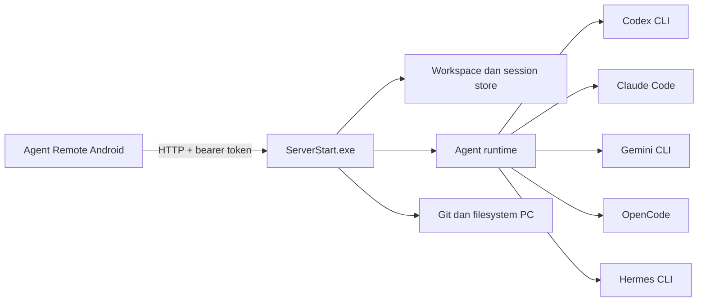

# Agent Remote

Agent Remote adalah aplikasi Android untuk mengontrol agent CLI yang berjalan di PC Windows. HP menjadi remote controller; agent, command, akses folder, Git, dan perubahan file tetap berjalan di PC.

Status dokumentasi: **18 Juli 2026**. Versi aplikasi: **0.3.0+2**.

## Fitur utama

- Deteksi otomatis Codex, Claude Code, Gemini CLI, OpenCode, dan Hermes.
- Mode **Single**, **Parallel**, dan **Koordinator**.
- Pemilihan drive atau folder kerja tanpa hardcode.
- Session tersimpan per folder.
- Persistent timeline untuk antrean, analisis, command, editing, testing, selesai, gagal, dan dihentikan.
- Foreground notification Android dengan action **Buka** dan **Stop**.
- Notifikasi task selesai dari Codex Desktop atau Codex CLI di PC.
- Restore folder, tab, dan session terakhir.
- Upload file, galeri, kamera, dan gambar clipboard Android.
- Panel task aktif, file workspace, Git status, commit, ahead/behind, dan fetch remote.
- Server Windows berupa `ServerStart.exe` tanpa jendela console.

## Arsitektur



Task tidak dijalankan di HP. HP hanya mengirim perintah, menerima stream, memantau proses, dan menampilkan notifikasi.

## Daftar isi

1. [Persyaratan](#persyaratan)
2. [Quick start](#quick-start)
3. [Menjalankan server PC](#menjalankan-server-pc)
4. [Menghubungkan HP ke PC](#menghubungkan-hp-ke-pc)
5. [Setup pertama di aplikasi](#setup-pertama-di-aplikasi)
6. [Memilih agent dan mode kerja](#memilih-agent-dan-mode-kerja)
7. [Folder, project, dan session](#folder-project-dan-session)
8. [Chat dan attachment](#chat-dan-attachment)
9. [Timeline dan background task](#timeline-dan-background-task)
10. [Git dan panel proses](#git-dan-panel-proses)
11. [Build dari source](#build-dari-source)
12. [Troubleshooting](#troubleshooting)
13. [Keamanan dan batasan](#keamanan-dan-batasan)

## Persyaratan

### Pengguna biasa

- PC Windows 10 atau Windows 11.
- Android 7.0 atau lebih baru.
- Minimal satu agent CLI terpasang dan dapat dipanggil dari `PATH` Windows.
- Port TCP `9120` dapat diakses dari HP.
- Tailscale pada PC dan HP untuk akses aman dari jaringan berbeda. LAN langsung juga didukung.
- Izin notifikasi Android agar progress task tetap terlihat saat aplikasi berada di background.

USB hanya diperlukan untuk instalasi APK melalui ADB. Setelah terpasang, Agent Remote memakai jaringan dan tidak memerlukan kabel USB.

### Developer

- Flutter SDK dan Android SDK.
- Python untuk server dan test backend.
- PyInstaller untuk membangun `ServerStart.exe`.
- Git dan CLI agent yang ingin diuji.

Pastikan agent dapat dijalankan langsung dari PowerShell sebelum membuka Agent Remote, misalnya `codex --version` atau `claude --version`.

## Quick start

### 1. Jalankan server PC

Double-click `ServerStart.exe` dari folder Agent Remote. Server default mendengarkan semua interface pada port `9120` dengan token development `admin`.

Verifikasi server dari PowerShell:

```powershell
$headers = @{ Authorization = "Bearer admin" }
Invoke-RestMethod http://127.0.0.1:9120/api/status -Headers $headers
```

Response status berarti server siap. Error koneksi berarti server belum berjalan, diblokir firewall, atau port sedang dipakai proses lain.

### 2. Hubungkan Tailscale

Install dan login Tailscale pada PC serta HP menggunakan tailnet yang sama. Pada PC:

```powershell
tailscale up
tailscale ip -4
```

Simpan IP `100.x.x.x` yang muncul. IP ini menjadi endpoint PC.

### 3. Install APK

Aktifkan USB debugging, sambungkan HP, lalu jalankan:

```powershell
adb devices
adb install -r .\build\app\outputs\flutter-apk\app-debug.apk
```

Perintah `adb devices` harus menampilkan HP dengan status `device`. Terima prompt otorisasi debugging bila muncul di HP.

### 4. Buat profile koneksi

Isi profile awal:

```text
Transport : custom
Endpoint  : http://<TAILSCALE-IP-PC>:9120
Username  : admin
Password  : admin
```

Pilih **Set as default**, tekan **Connect**, lalu izinkan notifikasi. Password dikirim sebagai bearer token; username hanya metadata profile pada implementasi saat ini.

## Menjalankan server PC

Jalankan manual dengan double-click `ServerStart.exe`, atau tanpa jendela console:

```powershell
Start-Process .\ServerStart.exe -WindowStyle Hidden
```

Konfigurasi default:

- Host: `0.0.0.0`
- Port: `9120`
- Token development: `admin`
- State server: `%LOCALAPPDATA%\AgentRemote\server.json`

Gunakan token sendiri sebelum pemakaian rutin:

```powershell
$env:AGENT_REMOTE_TOKEN = "ganti-dengan-token-panjang-dan-acak"
$env:AGENT_REMOTE_HOST = "0.0.0.0"
Start-Process .\ServerStart.exe -WindowStyle Hidden
```

Nama environment legacy `HERMES_REMOTE_TOKEN` dan `HERMES_REMOTE_HOST` masih dibaca untuk kompatibilitas. Konfigurasi baru wajib memakai prefix `AGENT_REMOTE_`.

Hentikan server:

```powershell
Get-Process ServerStart -ErrorAction SilentlyContinue | Stop-Process
```

Jangan restart atau hentikan server ketika task aktif. Proses agent berjalan di PC; monitoring tertunda sampai server tersedia kembali.

## Menghubungkan HP ke PC

### Tailscale direct IP — direkomendasikan

Gunakan endpoint `http://100.x.x.x:9120`. Metode ini stabil untuk reconnect dan background task karena tidak bergantung pada resolusi MagicDNS.

### Tailscale Serve HTTPS

Tailscale Serve dapat mengekspos server melalui URL HTTPS tailnet. Gunakan bila HTTPS atau hostname lebih penting. Jika sinkronisasi lambat saat aplikasi berada di background, kembali ke direct Tailscale IP.

### LAN langsung

Jika HP dan PC berada pada Wi-Fi yang sama, gunakan `http://<IP-LAN-PC>:9120`. Cari IP PC dengan `ipconfig`. Jaringan public atau guest Wi-Fi dapat memblokir komunikasi antarperangkat.

Jika Windows Firewall memblokir port, buat rule untuk jaringan private:

```powershell
New-NetFirewallRule -DisplayName "Agent Remote 9120" -Direction Inbound -Protocol TCP -LocalPort 9120 -Action Allow -Profile Private
```

USB bukan transport runtime. Kabel hanya untuk instalasi atau debug APK; chat dan progress tetap lewat HTTP, Tailscale, atau LAN.

## Setup pertama di aplikasi

1. Buka **Pengaturan**.
2. Masuk ke **Agent connection** lalu **PC agent gateway**.
3. Tambahkan profile baru.
4. Isi endpoint, username, dan password/token.
5. Tandai sebagai profile default.
6. Tekan **Connect**.
7. Pastikan status online sebelum memilih folder.

Profile default dipakai untuk auto-connect ketika aplikasi dibuka kembali. Credential disimpan melalui Android Keystore, bukan sebagai teks biasa di UI.

## Memilih agent dan mode kerja

Agent Remote mendeteksi CLI yang tersedia di PC. Agent yang didukung:

- Codex
- Claude Code
- Gemini CLI
- OpenCode
- Hermes

Hanya agent yang terpasang, berada di `PATH`, dan lolos deteksi server yang dapat dipilih. Restart server setelah memasang CLI baru.

Mode kerja:

- **Single**: satu task dijalankan oleh satu agent pilihan.
- **Parallel**: beberapa agent mengerjakan prompt secara independen; hasil tiap agent tetap terpisah.
- **Koordinator**: worker melakukan analisis, lalu lead agent menyatukan hasil dan menyelesaikan task.

Agent pilihan selalu dicatat pada session dan timeline. Jika Codex gagal, UI menampilkan kegagalan Codex; server tidak boleh diam-diam berpindah ke Hermes.

Untuk Codex, pilih permission sesuai kebutuhan:

- **Ask for approval**: aksi sensitif menunggu persetujuan.
- **Otomatis di workspace**: agent bebas bekerja di folder terpilih, tetap dibatasi workspace.
- **Full access**: bypass sandbox; gunakan hanya pada PC dan project tepercaya.

Provider API seperti 9router dikonfigurasi pada CLI agent atau environment PC. Agent Remote menjalankan CLI tersebut dan tidak mengganti konfigurasi provider internalnya.

## Folder, project, dan session

1. Dari halaman awal, buka pemilih workspace.
2. Pilih drive atau folder mana pun yang tersedia di PC.
3. Pilih session lama atau tekan **New Chat**.
4. Saat kembali ke aplikasi, Agent Remote memulihkan folder dan session terakhir.

Session disimpan per folder pada `.agent-remote\sessions.json`. Data lama dari `.hermes-remote\sessions.json` dimigrasikan bila ditemukan. Folder berbeda memiliki daftar session berbeda; session project A tidak dicampur dengan project B.

Daftar recent folder mempercepat perpindahan project. Menghapus atau memindahkan folder dari PC dapat membuat session tersebut tidak dapat dibuka sampai path dipulihkan atau folder dipilih ulang.

## Chat dan attachment

Tekan **New Chat**, pilih agent, lalu kirim instruksi. Agent bekerja di folder aktif pada PC, bukan di storage HP.

Attachment dapat berasal dari:

- Galeri.
- Kamera.
- File picker Android.
- Gambar clipboard Android yang dapat diakses aplikasi.

Batas saat ini: maksimal 10 attachment per pesan dan 15 MB per file. Preview attachment muncul sebelum pesan dikirim.

Android tidak selalu memberi aplikasi akses langsung ke gambar clipboard, terutama jika clipboard berisi URI sementara dari aplikasi lain. Jika paste gagal, simpan gambar ke galeri lalu pilih melalui attachment picker.

## Timeline dan background task

Setiap run memiliki `run_id`, `session_id`, agent, timestamp, status, dan detail aktivitas. Fase umum:

- `queued`: menunggu eksekusi.
- `thinking`: menganalisis task.
- `running`: menjalankan command atau tool.
- `editing`: mengubah file.
- `testing`: build atau test.
- `waiting_approval`: menunggu persetujuan.
- `completed`, `failed`, atau `stopped`: status akhir.

Timeline disimpan di backend. Keluar dari session atau berpindah aplikasi tidak menghapus progress. Saat session dibuka kembali, aplikasi memuat aktivitas tersimpan, bukan hanya label `Thinking`.

Gunakan **Lihat proses** untuk membuka detail command dan output tool. Ringkasan progress tetap singkat; raw chain-of-thought internal tidak ditampilkan.

Saat task berjalan, Android foreground service menampilkan notifikasi ongoing berisi agent dan aktivitas terbaru. Saat selesai, notifikasi menampilkan hasil akhir. Action yang tersedia: **Buka** dan **Stop**.

Durasi otomatis memakai detik, menit, lalu jam. Timestamp aktivitas dikonversi ke timezone perangkat pengguna. Tombol **Stop** menghentikan process tree agent di PC, termasuk child `cmd.exe`, Node.js, PowerShell, atau tool lain yang dibuat agent.

Izinkan notifikasi dan penggunaan background pada pengaturan Android. Force stop aplikasi menghentikan foreground service. Push cloud melalui FCM belum tersedia; monitoring saat ini bergantung pada koneksi langsung ke server PC.

### Sinkron Codex Desktop dan CLI

Codex mendukung command `notify` yang dipanggil ketika turn selesai. Arahkan hook tersebut ke server Agent Remote:

```toml
notify = ["C:\\path\\ke\\AgentRemote\\ServerStart.exe", "--codex-notify"]
```

`ServerStart.exe --codex-notify` meneruskan event selesai ke server lokal, menyimpannya pada panel **Proses**, lalu foreground sync Android mengirim notifikasi ke HP. Bridge tetap meneruskan event `turn-ended` ke helper Computer Use Codex bila helper tersebut tersedia.

Setelah mengubah `~/.codex/config.toml`, restart Codex Desktop agar config baru pasti dimuat. Buka Agent Remote sekali dan connect ke PC untuk mengaktifkan foreground sync. Setelah aktif, task Codex Desktop/CLI yang selesai tetap memunculkan notifikasi saat aplikasi berada di background.

## Git dan panel proses

Tab **Proses** menampilkan seluruh task aktif dan status terakhir, termasuk task dari session yang sedang tidak dibuka. Task tetap dapat dipantau setelah keluar dari chat selama server dan aplikasi monitoring tetap aktif.

Tab **File** menampilkan isi workspace dan perubahan file. Jika folder adalah repository Git, Agent Remote menampilkan:

- Working tree status.
- Commit terbaru.
- Remote repository.
- Ahead/behind terhadap upstream.
- Hasil fetch remote.

Agent Remote tidak otomatis commit atau push hanya karena perubahan terlihat. Minta agent secara eksplisit untuk commit atau push, lalu tinjau perubahan dan izin Git sebelum menyetujui.

Repository resmi proyek menggunakan nama `vanszas/agent-remote`. Nama remote yang tampil di aplikasi dibaca langsung dari `origin` repository aktif.

## Build dari source

Jalankan dari root repository.

### Android

```powershell
flutter pub get
dart format --set-exit-if-changed .
flutter analyze
flutter test
flutter build apk --debug
```

APK debug tersedia di:

```text
build\app\outputs\flutter-apk\app-debug.apk
```

Install ulang tanpa menghapus data aplikasi:

```powershell
adb install -r .\build\app\outputs\flutter-apk\app-debug.apk
```

### Server Windows

Instal PyInstaller dengan `uv`, build executable, lalu salin hasilnya ke root repository:

```powershell
uv tool install pyinstaller
pyinstaller --clean --noconfirm HermesRemoteServer.spec
Copy-Item .\dist\ServerStart.exe .\ServerStart.exe -Force
```

Walau nama spec internal masih `HermesRemoteServer.spec`, executable dan branding pengguna adalah Agent Remote.

### Test backend

```powershell
uv run --with pytest pytest test/remote_server_test.py -q
```

Build berhasil hanya membuktikan source dapat dikompilasi. Uji koneksi nyata, attachment, background service, session restore, dan agent reply pada HP sebelum membuat release.

## Troubleshooting

### Status offline atau tidak dapat connect

1. Pastikan `ServerStart.exe` berjalan.
2. Uji `http://127.0.0.1:9120/api/status` dari PC dengan bearer token.
3. Pastikan endpoint HP memakai IP PC, bukan `127.0.0.1`.
4. Coba direct Tailscale IP `100.x.x.x`.
5. Periksa Windows Firewall dan koneksi Tailscale pada kedua perangkat.

### `401 Unauthorized`

Password profile harus sama dengan `AGENT_REMOTE_TOKEN` yang dipakai saat server dimulai. Setelah token berubah, restart server lalu perbarui profile Android.

### Sinkronisasi Tailscale lambat

Hindari MagicDNS lebih dahulu. Ganti hostname dengan direct Tailscale IP. Matikan battery optimization untuk Agent Remote dan izinkan background data. Tailscale harus tetap aktif di HP.

### Agent tidak terdeteksi

Jalankan CLI dari PowerShell, misalnya:

```powershell
codex --version
claude --version
gemini --version
opencode --version
```

Jika command tidak ditemukan, tambahkan lokasi executable ke `PATH`, buka PowerShell baru, lalu restart `ServerStart.exe`. Agent Remote hanya menampilkan agent yang benar-benar tersedia.

### Codex gagal karena trusted directory

Build server terbaru menjalankan Codex dengan `--skip-git-repo-check`. Jika error lama masih muncul, hentikan server lama, rebuild atau ganti `ServerStart.exe`, lalu jalankan ulang. Pastikan folder pilihan masih ada dan account Windows memiliki izin baca/tulis.

### Progress kembali menjadi `Thinking`

Pastikan aplikasi dan server memakai build terbaru. Timeline harus dimuat dari backend berdasarkan run/session, bukan hanya stream aktif. Jangan hapus `.agent-remote\sessions.json` ketika task berjalan.

### Notifikasi tidak muncul

- Izinkan notification permission.
- Izinkan foreground service dan background usage.
- Nonaktifkan battery optimization untuk Agent Remote bila vendor HP agresif.
- Jangan force stop aplikasi.
- Pastikan task benar-benar berstatus aktif pada tab **Proses**.

### Gambar clipboard tidak dapat ditempel

Android atau aplikasi sumber dapat memberi URI sementara yang tidak dapat dibaca Agent Remote. Simpan gambar ke galeri atau file, lalu pilih melalui attachment picker.

### Port `9120` sudah dipakai

Cari proses pemilik port:

```powershell
Get-NetTCPConnection -LocalPort 9120 -ErrorAction SilentlyContinue |
  Select-Object LocalAddress, LocalPort, State, OwningProcess
```

Hentikan proses lama dengan aman. Port saat ini ditetapkan pada source server; memakai port lain memerlukan perubahan source, rebuild `ServerStart.exe`, dan pembaruan endpoint aplikasi.

### Server tidak menampilkan jendela

Ini normal. `ServerStart.exe` dibuat windowless. Verifikasi melalui endpoint status, Task Manager, atau:

```powershell
Get-Process ServerStart -ErrorAction SilentlyContinue
```

## Keamanan dan batasan

- Token default `admin` hanya untuk development. Ganti sebelum PC dapat diakses pengguna lain.
- HTTP cleartext hanya layak pada LAN tepercaya atau di dalam tunnel Tailscale. Jangan expose port `9120` langsung ke internet.
- Mode Codex **Full access** dapat membaca, mengubah, menjalankan, atau menghapus file sesuai hak account Windows. Pakai hanya pada workspace tepercaya.
- Review command, diff, dan approval sebelum memberi izin pada operasi sensitif.
- Credential profile Android disimpan melalui Keystore, tetapi keamanan tetap bergantung pada lock screen dan keamanan perangkat.
- APK debug belum release-signed dan tidak ditujukan untuk distribusi publik.
- Push cloud FCM belum dikonfigurasi. Notifikasi background saat ini memakai foreground service lokal dan koneksi ke PC.
- Bridge Codex menyimpan endpoint loopback dan token server pada `%LOCALAPPDATA%\AgentRemote\bridge.json`; file hanya boleh diakses account Windows pengguna.
- Managed cloud gateway belum tersedia. Koneksi utama masih langsung ke server lokal pengguna.
- Nama package dan beberapa file internal masih memakai `hermes_remote` untuk backward compatibility. Branding UI dan produk adalah **Agent Remote**; tidak ada fallback Hermes saat agent lain dipilih.

Untuk penggunaan harian: gunakan token kuat, Tailscale direct IP, mode permission paling rendah yang cukup, dan backup repository sebelum memberi agent akses tulis.
