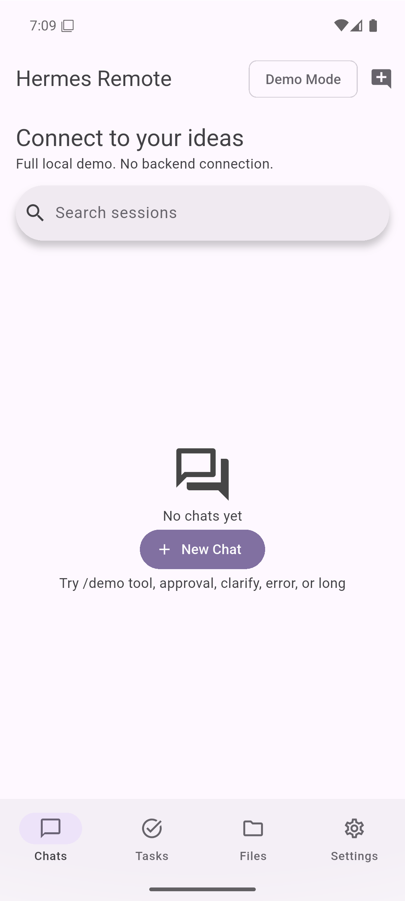

# Hermes Remote

Flutter Android app-first prototype for Hermes Agent. Current mode is fully local through `DemoAgentConnector`; no Hermes login or network connector exists.



## Available

- Local session history, search, pin, rename, delete
- Deterministic streamed demo responses
- Simulated tools, typed approvals/clarification, stop, and failure
- Local image/file attachment metadata
- Material 3 phone/tablet navigation
- System/light/dark themes
- Data-driven connection catalog and local profile CRUD
- Versioned JSON persistence with atomic replacement

## Architecture

```text
Flutter UI → AppController → AgentConnector → DemoAgentConnector
Connection UI → ConnectionSettingsController → JSON catalog/profile store
```

A real `HermesAgentConnector` is deferred.

## Run

```bat
cd /d "C:\Kerjaan\Monokotil\Apps\HermesRemote"
flutter run -d emulator-5554
```

Use `flutter devices` when the serial differs.

## Verify

```bat
dart format --set-exit-if-changed .
flutter analyze
flutter test
flutter build apk --debug
```

## Limitations

No Hermes backend, login, REST, WebSocket, Tailscale, USB bridge, or Hermes Cloud integration. Connection profiles are metadata only. Debug APK is development-only; release signing is not configured. Runtime attachment/camera and full persistence matrix remain partially verified; see [`docs/verification/phase2.md`](docs/verification/phase2.md).

## Roadmap

Local gateway → Hermes Cloud → Remote gateway connector compatibility and integration.

## Security

No credentials belong in source or connection profile JSON. Connector integration must add secure storage and explicit authentication later.
